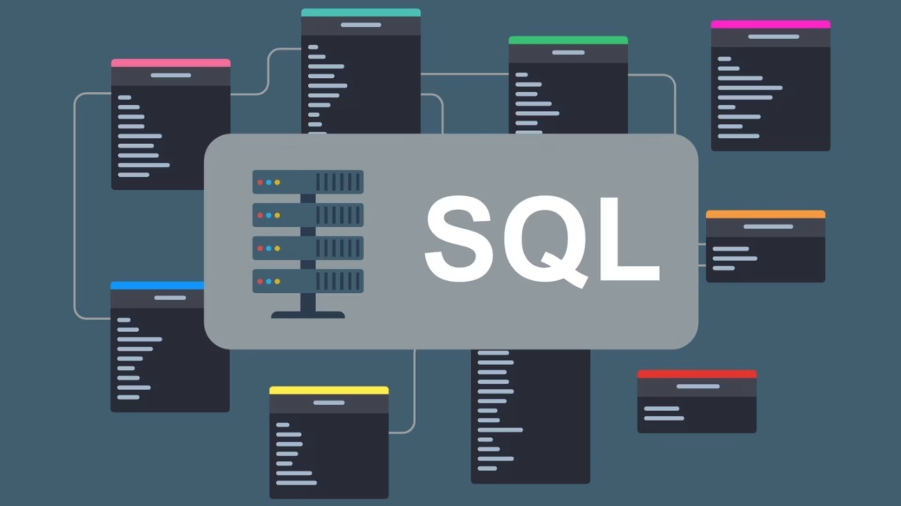
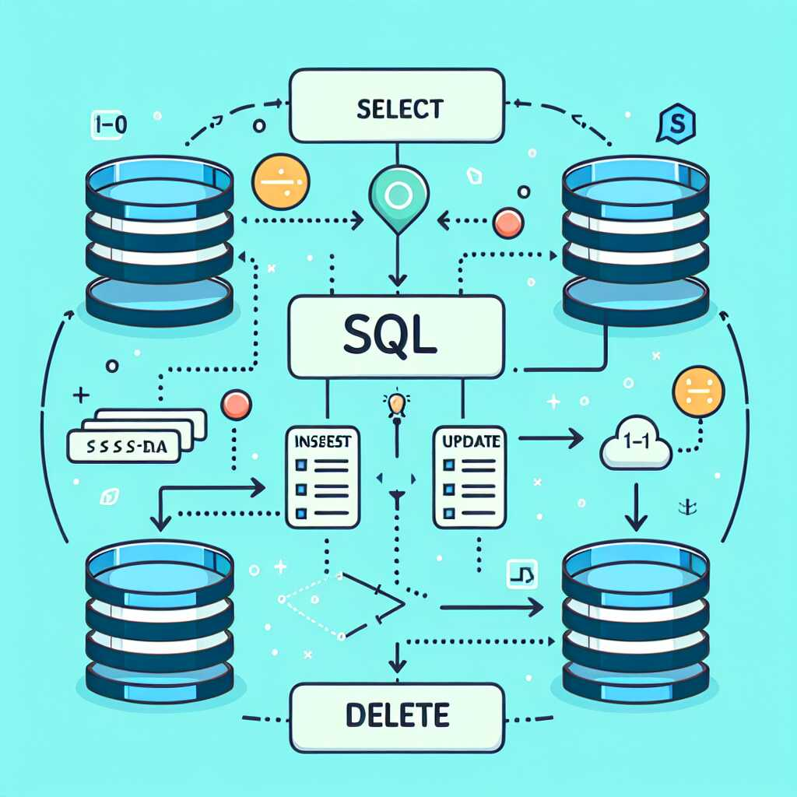

## `Giới thiệu:`
**SQL (Structured Query Language)** là ngôn ngữ chuẩn được sử dụng để tương tác và quản lý cơ sở dữ liệu quan hệ (Relational Database). SQL được thiết kế để thực hiện các thao tác như truy vấn, thêm, sửa, xóa và quản lý dữ liệu trong cơ sở dữ liệu. 

**1. Chức năng chính**
- **Truy vấn dữ liệu (Query):** Sử dụng lệnh `SELECT` để truy xuất dữ liệu từ các bảng trong cơ sở dữ liệu.
- **Thao tác dữ liệu:** 
  - **Thêm:** Sử dụng lệnh `INSERT INTO` để thêm dữ liệu mới vào bảng.
  - **Cập nhật:** Sử dụng lệnh `UPDATE` để cập nhật dữ liệu trong bảng.
  - **Xóa:** Sử dụng lệnh `DELETE` để xóa dữ liệu khỏi bảng.
- **Quản lý cơ sở dữ liệu:** 
  - **Tạo cơ sở dữ liệu:** Sử dụng lệnh `CREATE DATABASE` để tạo cơ sở dữ liệu mới.
  - **Xóa cơ sở dữ liệu:** Sử dụng lệnh `DROP DATABASE` để xóa cơ sở dữ liệu.
  - **Tạo bảng:** Sử dụng lệnh `CREATE TABLE` để tạo bảng mới trong cơ sở dữ liệu.
  - **Xóa bảng:** Sử dụng lệnh `DROP TABLE` để xóa bảng khỏi cơ sở dữ liệu.
  
- **Kiểm soát quyền truy cập:** Sử dụng lệnh `GRANT` và `REVOKE` để kiểm soát quyền truy cập của người dùng đến cơ sở dữ liệu.

**2. Các loại câu lệnh SQL**

SQL được chia thành nhiều loại chính dựa trên mục đích sử dụng:
- **DDL (Data Definition Language):** Dùng để định nghĩa cấu trúc của cơ sở dữ liệu.
  - `CREATE`: Tạo cơ sở dữ liệu và bảng.
  - `ALTER`: Thay đổi cấu trúc của cơ sở dữ liệu.
  - `DROP`: Xóa cơ sở dữ liệu và bảng.
  - `TRUNCATE`: Xóa toàn bộ dữ liệu trong bảng.
  - `RENAME`: Đổi tên bảng.
  - `COMMENT`: Thêm comment cho bảng.
  - `TRIGGER`: Tạo trigger.
- **DML (Data Manipulation Language):** Dùng để thao tác dữ liệu trong cơ sở dữ liệu.
  - `SELECT`: Truy vấn dữ liệu.
  - `INSERT`: Thêm dữ liệu mới.
  - `UPDATE`: Cập nhật dữ liệu.
  - `DELETE`: Xóa dữ liệu.
  - `MERGE`: Kết hợp INSERT, UPDATE, DELETE.
- **DCL (Data Control Language):** Dùng để kiểm soát quyền truy cập dữ liệu.
  - `GRANT`: Cấp quyền truy cập.
  - `REVOKE`: Thu hồi quyền truy cập.
  - `DENY`: Từ chối quyền truy cập.
- **TCL (Transaction Control Language):** Dùng để kiểm soát giao dịch.
  - `COMMIT`: Lưu thay đổi vào cơ sở dữ liệu.
  - `ROLLBACK`: Hủy thay đổi.
  - `SAVEPOINT`: Đánh dấu vị trí trong giao dịch.
  - `SET TRANSACTION`: Bắt đầu giao dịch.
  - `SET CONSTRAINTS`: Xác định ràng buộc cho giao dịch.
  - `LOCK TABLE`: Khóa bảng.

**3. Kết luận**

SQL là một công cụ không thể thiếu trong việc quản lý và xử lý dữ liệu, đặc biệt trong các hệ thống ứng dụng và website hiện đại.   